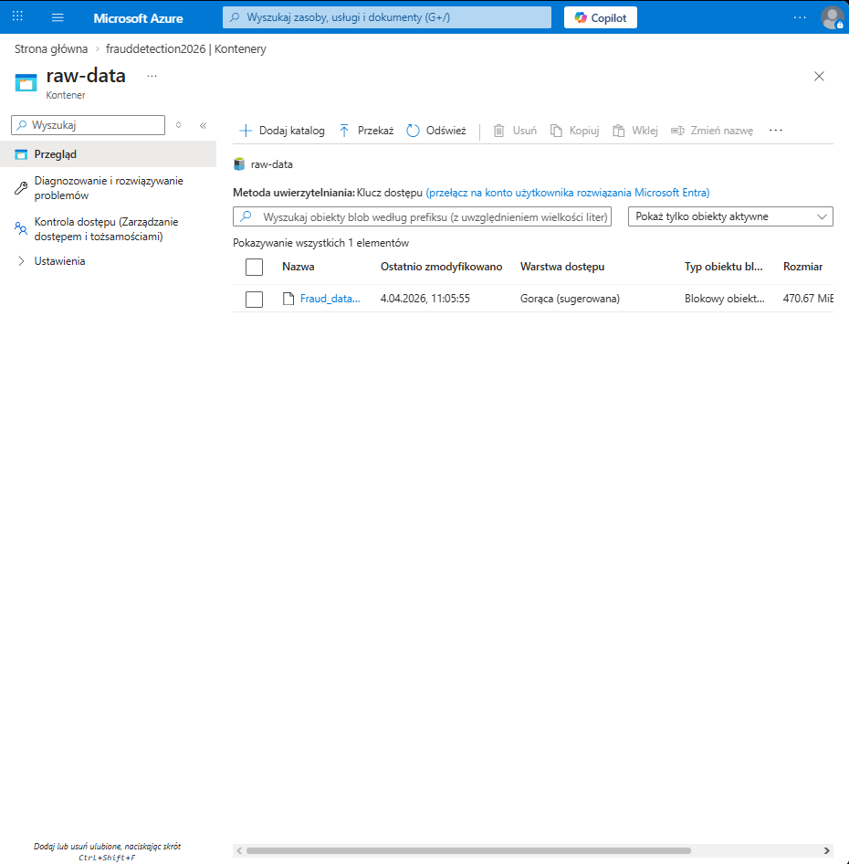
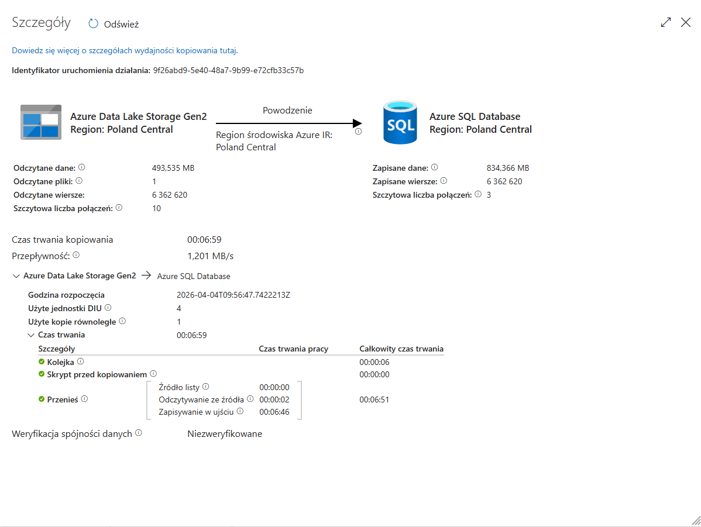

# 🏦 End-to-End Fraud Detection System on Azure

## 📌 Project Overview
This project focuses on detecting fraudulent financial transactions and identifying hidden anomalies within a massive financial dataset. The primary goal is to uncover illicit activities, enabling financial institutions to take proactive security measures and minimize monetary losses.

The project consists of three main phases: **Cloud Data Engineering** to build an automated, scalable data ingestion pipeline on Microsoft Azure, **Exploratory Data Analysis (EDA)** to understand the data and uncover key fraud patterns, and **Advanced Anomaly Detection** to build predictive solutions focused on cost-sensitive business optimization.

## 📊 Dataset Information
The data used in this project comes from Synthetic Financial Datasets For Fraud Detection dataset  available on Kaggle.
* **Source:** https://www.kaggle.com/datasets/ealaxi/paysim1
* **Records:** 6362620
* **Features:** 10 columns (9 features + 1 target variable)
* **Class imbalance:** isFraud = 1: 8213 (~ 0,13 %) | isFraud = 0: 6354407 (~ 99,87 %)
> Column descriptions sourced from the official Kaggle dataset page.

## 📂 Project Architecture
The project follows a Medallion architecture (Bronze → Silver → Gold) to ensure structured and scalable data processing.
### 1️⃣ Phase 1: Cloud Data Engineering

#### 🥉 Bronze Layer – Data Ingestion
Currently, the raw data ingestion pipeline is implemented.
##### Architecture
1. **Data Lake:** Stored securely in **Azure Data Lake Storage Gen2** (`raw-data` container).
2. **Orchestration:** **Azure Data Factory (ADF)** pipeline created to dynamically read the CSV and auto-create the schema.
3. **Database:** Data loaded into **Azure SQL Database** (Serverless tier for cost optimization).

##### Data Ingestion Proof
**1. Raw Data in Azure Data Lake:**

**2. ADF Pipeline Success:**

##### Data Validation (SQL) 
Initial data profiling was performed after ingestion to ensure data quality and completeness.
- Total records: 6362620
- Fraud cases: 8213 (~ 0,13 %)
- Non-fraud cases: 6354407 (~ 99,87 %)
##### SQL Validation Script
File `01_data_profiling.sql`
