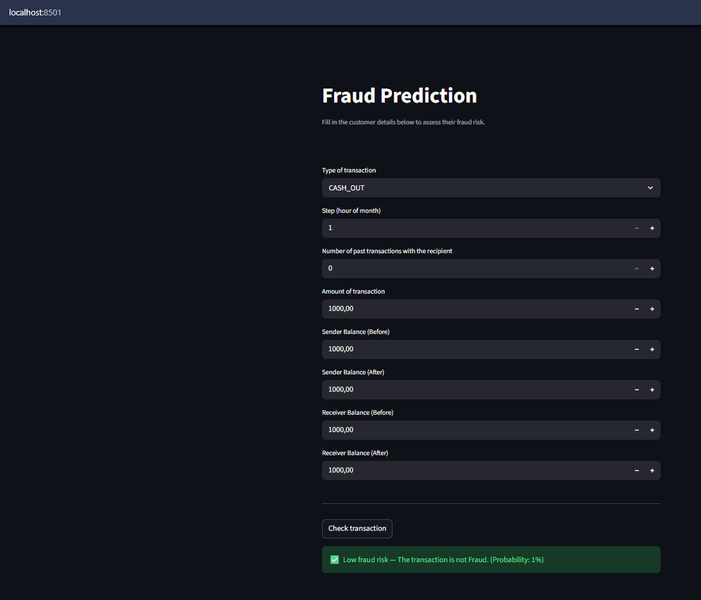
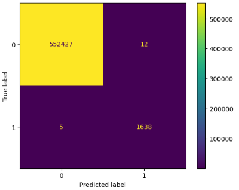
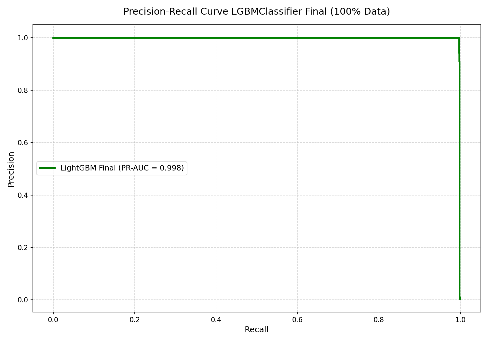
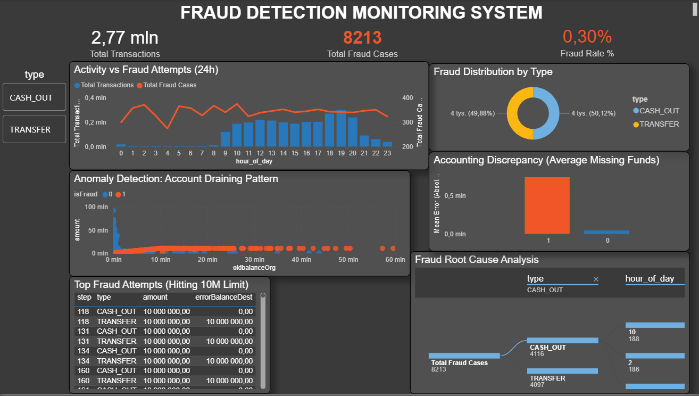

# 🏦 End-to-End Fraud Detection System on Azure

## 📌 Project Overview
This project focuses on detecting fraudulent financial transactions and identifying hidden anomalies within a massive financial dataset. The primary goal is to uncover illicit activities, enabling financial institutions to take proactive security measures and minimize monetary losses.

The project consists of four main phases: **Cloud Data Engineering** to build an automated, scalable data ingestion pipeline on Microsoft Azure, **Exploratory Data Analysis (EDA)** to understand the data and uncover key fraud patterns,  **Advanced Anomaly Detection** to build predictive solutions focused on cost-sensitive business optimization and **Model Deployment** 

## 📊 Dataset Information
The data used in this project comes from Synthetic Financial Datasets For Fraud Detection dataset  available on Kaggle.
* **Source:** https://www.kaggle.com/datasets/ealaxi/paysim1
* **Records:** 6362620
* **Features:** 10 columns (9 features + 1 target variable)
* **Class imbalance:** isFraud = 1: 8213 (~ 0,13 %) | isFraud = 0: 6354407 (~ 99,87 %)
> Column descriptions sourced from the official Kaggle dataset page.


## 🛠️ Tech Stack & Tools
* **Languages:** Python, SQL
* **Cloud & Data Engineering:** Azure Data Factory (ADF), Azure Data Lake Storage Gen2, Azure SQL Database
* **Containerization & Deployment:** Docker, Streamlit
* **Business Intelligence:** Power BI
* **Data Manipulation & Analysis:** `pandas`
* **Data Visualization:** `seaborn`, `matplotlib`
* **Machine Learning:** `scikit-learn`, `lightgbm`


## 📂 Project Architecture
The project follows a Medallion architecture (Bronze → Silver → Gold) to ensure structured and scalable data processing.
### 1️⃣ Phase 1: Cloud Data Engineering

#### 🥉 Bronze Layer – Data Ingestion
Currently, the raw data ingestion pipeline is implemented.
##### Architecture
1. **Data Lake:** Stored securely in **Azure Data Lake Storage Gen2** (`raw-data` container).
2. **Orchestration:** **Azure Data Factory (ADF)** pipeline created to dynamically read the CSV and auto-create the schema.
3. **Database:** Data loaded into **Azure SQL Database** (Serverless tier for cost optimization).

**Data Ingestion Proof**  

**1. Raw Data in Azure Data Lake:**  


**2. ADF Pipeline Success:**  


##### Data Validation (SQL) 
Initial data profiling:
- Total records: 6362620
- Fraud cases: 8213 (~ 0,13 %)
- Non-fraud cases: 6354407 (~ 99,87 %)
##### SQL Validation Script
All data profiling queries are stored in:
File `01_data_profiling.sql`

File: `sql/01_data_profiling.sql`

This script includes:
- Row count verification
- Schema inspection
- Target variable distribution (class imbalance)
- Basic data preview

#### 🥈 Silver Layer – Data Filtering  & Feature Engineering
In this stage, the raw data was transformed into a model-ready format using SQL Views. This approach ensures resource optimization (no data duplication) and dynamic updates.

##### Key Transformations:
1. **Data Filtering:** Reduced the dataset from 6.3M to ~2.77M records by focusing exclusively on `TRANSFER` and `CASH_OUT` transaction types, where the majority of fraud cases occur.
2. **Feature Engineering:** Created two new analytical columns to capture mathematical discrepancies in account balances:
    - `errorBalanceOrig`: Calculates the difference between the intended and actual balance of the sender.
    - `errorBalanceDest`: Calculates the difference between the intended and actual balance of the receiver.

##### SQL Transformation Script
File `sql/02_feature_engineering.sql`

### 2️⃣ Phase 2: Exploratory Data Analysis & 🥇 Gold Layer Preparation
Building upon the **Silver Layer** generated via Azure SQL, this phase utilizes Python (`pandas`, `seaborn`) to perform deep EDA and construct the **Gold Layer** — a highly enriched, model-ready dataset.

**1. Data Cleaning & Validation:**
* Verified and corrected column data types for memory optimization.
* Conducted data quality checks (missing values and duplicates validation) to ensure data integrity.

**2. Exploratory Data Analysis:**
* **Univariate & Bivariate Analysis:** Visualized individual feature distributions and their relationships with the `isFraud` target. 
* **Correlation Analysis:** Evaluated linear relationships between numerical variables to identify potential multi-collinearity and predictive power.

**3. Python-Based Feature Engineering (Gold Layer Enablers):**
To finalize the Gold Layer for machine learning, additional predictive features were engineered to capture behavioral and temporal patterns:
* **Temporal Features:** Extracted `hour` and `day_of_week` from the continuous `step` variable to model the 24/7 nature of automated fraud.
* **`accountDrained` Flag:** A binary indicator (`1` or `0`) capturing transactions that completely emptied the sender's account (`newbalanceOrig == 0` and `amount > 0`).
* **`isHighAmount` Flag:** A dynamic binary flag marking transactions that exceed the 95th percentile of transfer amounts, effectively isolating high-risk monetary movements.

### 3️⃣ Phase 3: Advanced Anomaly Detection

This phase focused on identifying the most effective algorithm to handle extreme class imbalance (0.3% fraud) and high data volume (2.7M records).

**1. Model Selection & Benchmarking:**
* **Logistic Regression:** Served as a baseline for linear separability.
* **Isolation Forest:** Tested as an unsupervised anomaly detection approach to identify "distant" outliers (proved insufficient for this specific business case).
* **LightGBM (Final Choice):** Selected for its superior handling of large-scale data, high computational speed, and ability to capture complex non-linear fraud patterns.

**2. Multi-Stage Training Strategy:**
To optimize computational time and local hardware resources (RAM limits), a three-stage training approach was implemented:
* **Baseline (100% Data):** Initial training on default parameters to establish performance benchmarks.
* **Rapid Optimization (10% Sub-sample):** Utilized `RandomizedSearchCV` and `StratifiedKFold` on a balanced 10% subset for efficient hyperparameter exploration without memory overload.
* **Final Optimization (100% Data):** Executed a second, massive `RandomizedSearchCV` pass on the full 2.7M dataset. The algorithm naturally selected a much deeper architecture (e.g., `num_leaves: 151`, `max_depth: 8`, `class_weight: 'balanced'`) to fully leverage the enormous data volume without overfitting.


### 4️⃣ Phase 4: Model Deployment 
The application has been successfully containerized and equipped with an interactive web interface, making it fully reproducible and cloud-ready.

* **Containerization (Docker):** Packaged the ML model, Streamlit app, and system dependencies into a standalone Docker container. 
* **Interactive Web UI (Streamlit):** Developed a user-friendly frontend allowing analysts to input transaction details and receive real-time predictions.
* **Cloud-Ready Architecture:** Configured `Dockerfile` and `requirements.txt` for seamless deployment to any container hosting service.



## 📈 Results 
The final **LightGBM Classifier** achieved exceptional results, proving to be highly reliable for production-grade fraud detection.



| Metric | Score | Business Impact |
| :--- | :--- | :--- |
| **Recall** | **99.70%** | Intercepted **1,638 out of 1,643** frauds. |
| **Precision** | **99.27%** | Only **12 false alarms** out of 554k transactions. |
| **F1-Score** | **0.9948** | Perfect balance between detection and friction. |
| **PR-AUC** | **0.9981** | Exceptional model stability across all thresholds. |

**Performance Analysis:**
The model demonstrates a near-perfect ability to distinguish between legitimate and fraudulent activities. By prioritizing **Recall**, the system minimizes financial losses by missing only 5 transactions, while the high **Precision** ensures that honest customers face virtually zero friction (only 12 accounts flagged incorrectly).


.
## 🔍 Key Findings
**1. Data & Business Insights (EDA):**

* **Targeted Attacks & Extreme Imbalance:** Fraud represents merely 0.13% of all transactions and occurs exclusively within two transaction types: **CASH_OUT** and **TRANSFER**.
* **Automated 24/7 Operations:** While legitimate user activity naturally peaks between 9 AM and 8 PM, fraud attempts remain relatively constant around the clock. This behavior strongly suggests the use of automated botnets or coordinated attacks originating from different time zones.
* **Exploiting System Limits:** The transaction amount distribution revealed that frauds involve significantly higher values than normal transfers. Notably, there is a massive spike in fraud at exactly the **10000000** mark, indicating systematic attempts by fraudsters to drain accounts up to a hardcoded system threshold.
* **The Accounting:** Engineered features tracking balance discrepancies (**errorBalanceOrig** and **errorBalanceDest**) proved to be near-perfect class separators. Genuine transactions always reconcile perfectly mathematically. In contrast, fraudulent events systematically break accounting logic, generating massive unrecorded balances on both the sender's and receiver's ends.

**2. Model Insights & Performance:**

* **Model Effectiveness:** The final LightGBM model successfully navigated the extreme class imbalance, achieving a **PR-AUC score of 0.9981**, driven by a **Recall of 99.70 %**. This ensures the vast majority of fraudulent attempts are intercepted with high precision.
* **Key Fraud Indicators:** According to the Feature Importance analysis, the model heavily relied on transaction size (**amount**), initial sender funds (**oldbalanceOrg**), destination account anomalies (**newbalanceDest**), and the frequency of destination account usage (**destTransactionCount**).

By combining these behavioral features with the detected accounting errors, the model effectively identifies "account emptying" patterns and the usage of newly created "mule" accounts.


## 📊 Power BI Security Operations Center (SOC) Dashboard

The final stage of the project is an interactive Power BI dashboard designed for real-time fraud monitoring. It filters out the noise of safe transactions to focus strictly on high-risk sectors, providing actionable insights through six key visualizations:

* **Executive KPIs:** Real-time tracking of high-risk transaction volume (2.77M), total confirmed fraud cases (8,213), and the overall Fraud Rate (0.30%).
* **Activity vs Fraud Attempts (24h):** A dual-axis chart contrasting the natural circadian rhythm of legitimate transactions (blue bars, peaking midday) against the flat, 24/7 automated activity of fraud bots (red line).
* **Fraud Distribution by Type:** A donut chart confirming that fraud occurs exclusively within `CASH_OUT` and `TRANSFER` transaction types, split almost exactly 50/50.
* **Accounting Discrepancy (Average Missing Funds):** Visual proof of the mathematical flaw exploited by attackers. Fraudulent transactions (red bar) generate massive average accounting errors on destination accounts, whereas legitimate transactions (blue bar) perfectly reconcile to zero.
* **Anomaly Detection (Account Draining Pattern):** A scatter plot mapping transaction amounts against original balances. Fraudulent transactions (red dots) form a distinct visual pattern, proving the "account draining" tactic where attackers transfer the exact total balance.
* **Top Fraud Attempts (Hitting 10M Limit):** A targeted matrix exposing automated scripts that repeatedly attempt to drain exactly $10,000,000—the system's hardcoded threshold.
* **Fraud Root Cause Analysis:** An AI-driven decomposition tree breaking down fraud cases by transaction type and hour of the day for quick, interactive drill-down investigations.

  

*(Note: The `.pbit` template file is available in the `/reports` folder. It requires a valid Azure access key to populate with live data).*

## 🚀 How to Run the App (Docker)
The application is fully containerized. To run the interactive Streamlit dashboard locally, follow these steps:
1. **Clone the repository:**
```bash
git clone https://github.com/Oliwer1992/Azure-Fraud-Detection.git  
cd Azure-Fraud-Detection
```
2. **Build the Docker image:**
```bash   
docker build -t fraud-detection-app .
```
3. **Run the container:**
```bash  
docker run -p 8501:8501 fraud-detection-app
```
4. **Access the dashboard:**


Open your web browser and navigate to: http://localhost:8501


